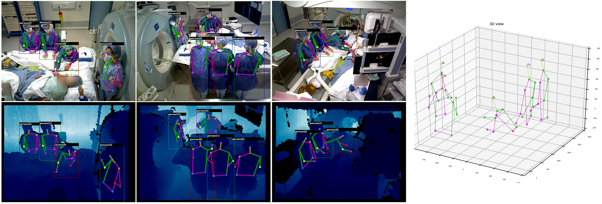
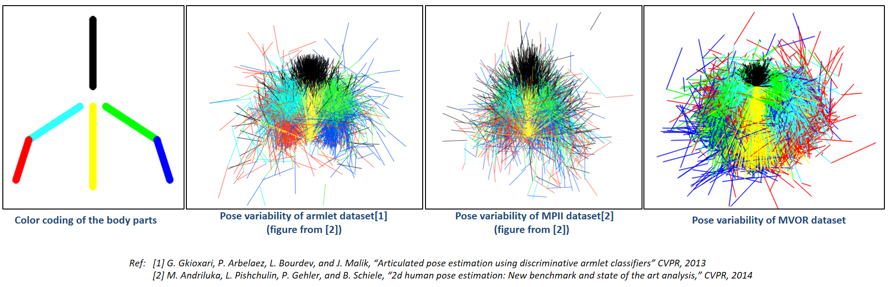
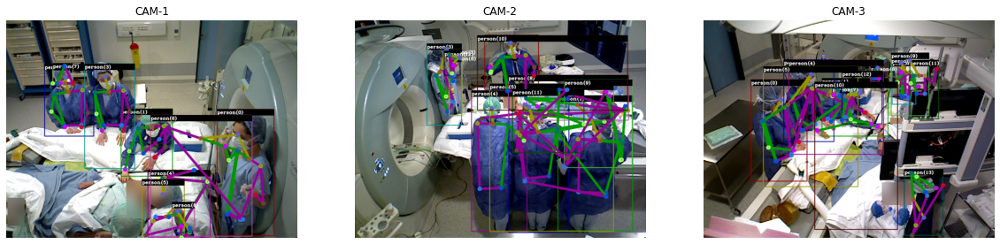

<div align="center">
<a href="http://camma.u-strasbg.fr/">

</a>
</div>


# MVOR
**A Multi-view RGB-D Operating Room Dataset for 2D and 3D Human Pose Estimation (MICCAI-LABELS-2018)**

_Vinkle Srivastav, Thibaut Issenhuth, Abdolrahim Kadkhodamohammadi, Michel de Mathelin, Afshin Gangi, Nicolas Padoy_

[](http://camma.u-strasbg.fr/datasets/) [](https://arxiv.org/abs/1808.08180) [](https://colab.research.google.com/github/CAMMA-public/MVOR/blob/master/mvor_demo.ipynb)


This repository contains the link to download the dataset as well as visualization and evaluation scripts. 

### Download the MVOR dataset and install the dependencies
The MVOR dataset is hosted on the [unistra S3 server](https://s3.unistra.fr/camma_public/datasets/mvor/camma_mvor_dataset.zip). Please download the dataset and install the dependencies using the commands given below. We tested the code on the Ubuntu 16.04, Python 3.7, PyTorch 1.5.1, CUDA 10.1 using the NVIDIA GeForce GTX 1080 Ti GPU.

```bash
$ MVOR=/path/to/mvor/repository
$ git clone https://github.com/CAMMA-public/MVOR.git $MVOR
$ cd $MVOR/
$ wget https://s3.unistra.fr/camma_public/datasets/mvor/camma_mvor_dataset.zip
$ unzip -q camma_mvor_dataset.zip && rm camma_mvor_dataset.zip
$ # Install Python dependencies
$ pip3 install -r $MVOR/requirements.txt
```
The dataset directory should look as follows:
```
──$MVOR
    ──camma_mvor_dataset
        ├───day1
        │   ├───cam1
        │   │   ├───color
        │   │   └───depth
        │   ├───cam2
        │   │   ├───color
        │   │   └───depth
        │   └───cam3
        │       ├───color
        │       └───depth

```

### DATASET DESCRIPTION

The MVOR dataset consists of 732 synchronized multi-view frames recorded by three RGB-D cameras in a hybrid OR. Each multi-view frame consists of three color and three depth images.
The MVOR dataset was sampled from four days of recording in an interventional room at the University Hospital of Strasbourg during procedures such as vertebroplasty and lung biopsy.
There are in total 4699 bounding boxes, 2926 2D keypoint annotations, and 1061 3D keypoint annotations.

<div align="center">
  
</div>

Ground truth file [**_camma_mvor_2018.json_**](annotations/camma_mvor_2018.json) contains the annotations in coco style format. We have added extra keys
'annotations3D', 'multiview_images', and 'cameras_info' to support 3D annotations and camera calibration parameters. The keys of the annotation json file are explained as follows:

```
[images] : Contains the id, filename, width, height of the image
[multiview_images] : Contains the id of the image triplet (multi-view frame)
[annotations] : Contains the 2D human pose annotations, 2D bounding box, image_id,
                person_id, person_role, and face_blurring status
[annotations3D] : Contain the 3D keypoints, image_id of multi-view frame and person_id
[cameras_info] : Contains the intrinsics (focal-length, principal-point, distortion) and
                 extrinsics (4x4 rigid transformation from 1st camera) parameters of the cameras,
                 also contain the transformation from the first camera to the world origin.

[licenses] : Contains the link to the license of Attribution-NonCommercial-ShareAlike 4.0 International (CC BY-NC-SA 4.0)
[dataset_info] : Contains the camera id to camera number mapping and also day id to day number mapping.
[categories] : Contains the 10 upper-body skeleton information
```

### Demo notebook
You can either open [`demo_notebook.ipynb`](mvor_demo.ipynb) on your local computer to run the visualization and evaluation scripts or if you do not have a suitable environment to run the code, then you can run it on the Google Colab.

[](https://colab.research.google.com/github/CAMMA-public/MVOR/blob/master/mvor_demo.ipynb)


### Visualize the 2D or 3D ground truth
See [_run_visualize_groundtruth.sh_](tools/run_visualize_groundtruth.sh) to run the visualization script.
This script also illustrates the use of the intrinsic/extrinsic camera calibration parameters to project 3D annotations on the images.
You can also run the [_visualize_groundtruth.py_](lib/visualize_groundtruth.py) as follows:

```bash
$ cd $MVOR/lib/
$ python3 visualize_groundtruth.py \
       --inp_json ../annotations/camma_mvor_2018.json \
       --img_dir ../dataset \
       --show_ann true \
       --viz_2D true \
       --show_3dto2dproj true \
       --viz_3D true \
#**********************  parameter explanation ***********************************************
#--inp_json => path to input json file containing 2D and 3D keypoints.
#--img_dir => path to the image directory.
#--show-ann => if false, will show only the dataset images without any annotations.
#--viz_2D => if true, will show the 2D keypoint annotations.
#--show_3dto2dproj => if true, will show the projections of 3D keypoints on all the frames.
#--viz_3D => if true, will show the 3D keypoints.
#--save_gt => if true, it will not render anything on the screen but write the visualization on the given path.
#--show_pose_variability = if true, it will show the 2D annotations pose variability of the MVOR dataset.
# *********************************************************************************************       
```

#### Pose variability of the MVOR dataset
Pose variability of the MVOR dataset can be visualized by setting _--show_pose_variability_ flag to true in [visualize_groundtruth.py](tools/run_visualize_groundtruth.sh) script.
Visual comparison w.r.t to armlet and MPII datasets is shown below.
<div align="center">
  
</div>

### Visualize and evaluate the 2D bounding box and keypoint predictions from the Keypoint-MaskRCNN model on the MVOR
See the [mvor_demo.ipynb](mvor_demo.ipynb) notebook file to run the inference and evaluation of Keypoint-MaskRCNN model from [pytorch's torchvision library](https://pytorch.org/docs/stable/torchvision/models.html#object-detection-instance-segmentation-and-person-keypoint-detection) on the MVOR dataset. A sample result on the MVOR multi-view frame is shown below.
<div align="center">
  
</div>


### MVOR stats
```bash
$ cd $MVOR/lib/
$ python show_stats.py --gt ../annotations/camma_mvor_2018.json
```

### Evaluate 2D pose estimation
See [_run_eval_pck_2dpose.sh_](tools/run_eval_pck_2dpose.sh) or run the 2d pose estimation evaluation script as follows:
```bash
$ cd $MVOR/lib/
# openpose
$ python3 eval_pck_2dpose.py --gt ../annotations/camma_mvor_2018.json --dt ../detections_results/openpose_kps.json
# openpose with multiscale testing
$ python3 eval_pck_2dpose.py --gt ../annotations/camma_mvor_2018.json --dt ../detections_results/openpose_kps_multiscale.json
# alphapose
$ python3 eval_pck_2dpose.py --gt ../annotations/camma_mvor_2018.json --dt ../detections_results/alphapose_kps.json
# rtpose
$ python3 eval_pck_2dpose.py --gt ../annotations/camma_mvor_2018.json --dt ../detections_results/rtpose_kps.json
# -------------------------------------------- PCK Results ----------------------------------------------------------------
#                                [Head Shou  Hip Elbo Wris] [ mean-pck ]
# openpose_results               [70.4 69.9 42.3 57.6 45.3] [ 57.1 ]
# openpose_results_multiscale    [71.2 70.6 41.6 60.2 47.9] [ 58.3 ]
# alphapose_results              [87.7 88.9 61.8 77.8 64.7] [ 76.2 ]
# rtpose_results                 [91.0 88.8 56.4 74.5 58.1] [ 73.8 ]
------------------------------------------------------------------------------------------------------------------------
```

### Evaluate 2D person detections
See [_run_eval_ap_2dperson.sh_](tools/run_eval_ap_2dperson.sh) or run the 2d person detection evaluation script as follows:
```bash
$ cd $MVOR/lib/
# faster rcnn
$ python3 eval_ap_2dperson.py --gt ../annotations/camma_mvor_2018.json --dt ../detections_results/faster_rcnn_bbox.json

# deformable conv-nets R-FCN
$ python3 eval_ap_2dperson.py --gt ../annotations/camma_mvor_2018.json --dt ../detections_results/dfcnet_rfcn_bbox.json
# -------------------------------------------- Results ----------------------------------------------------------------
#                                [   AP      AP⁵⁰        AP⁷⁵       AR¹       AR¹⁰    AR¹⁰⁰]
# faster RCNN                    [   0.504   0.756       0.574      0.300    0.598   0.601]
# deformable conv-nets R-FCN     [   0.404   0.620       0.466      0.271    0.451   0.451]
```

2D person detection from keypoints (here, the AR is not averaged over IoU in [0.50, 0.55, ..., 0.95], it is only given for IoU = 0.50) 
```bash
# openpose default
$ python3 eval_ap_2dperson.py --gt ../annotations/camma_mvor_2018.json --dt ../detections_results/openpose_bbox.json
# openpose multiscale
$ python3 eval_ap_2dperson.py --gt ../annotations/camma_mvor_2018.json --dt ../detections_results/openpose_bbox_multiscale.json
# alphapose default
$ python3 eval_ap_2dperson.py --gt ../annotations/camma_mvor_2018.json --dt ../detections_results/alphapose_bbox.json
# rtpose
$ python3 eval_ap_2dperson.py --gt ../annotations/camma_mvor_2018.json --dt ../detections_results/rtpose_bbox.json
# -------------------------------------------- Results ----------------------------------------------------------------
#                          [   AP⁵⁰    AR¹         AR¹⁰]
# openpose default         [   0.278   0.299       0.406]
# openpose multiscale      [   0.267   0.289       0.394]
# alphapose                [   0.512   0.331       0.636]
# rtpose                   [   0.371   0.274       0.475]
```
### Evaluate 3D pose estimation
See [_run_eval_mpjp_error_3dpose.sh_](tools/run_eval_mpjp_error_3dpose.sh) or run the matlab script to show the mv3dreg MPJP error results as follows:
```bash
$ cd $MVOR/lib/
# mv3dreg MPJP error results
$ matlab -nodisplay -nojvm -nosplash -nodesktop -r "eval_mpjp_error_3dpose('../detections_results/mv3dreg.mat');exit;"
# -------------------------------------------- Results ----------------------------------------------------------------
#                             -- Shoulder  Hip   Elbow  Wrist  Average-----
# results
# oneview                         14.4    29.9   27.3   36.1    26.9
# twoview                          8.1    16.0   19.4   29.8    18.3
# threeview                        4.9     9.9   10.5   14.3     9.9
```

### License
This source code, dataset, and annotations are licensed under the license found in the [`LICENSE`](LICENSE) file in the root directory of this source tree.
The MVOR dataset is publicly released under the Creative Commons license [CC-BY-NC-SA 4.0](https://creativecommons.org/licenses/by-nc-sa/4.0/). This implies that:
- the dataset cannot be used for commercial purposes,
- the dataset can be transformed (additional annotations, etc.),
- the dataset can be redistributed as long as it is redistributed under the same license with the obligation to cite the contributing work which led to the generation of the MVOR dataset (mentioned above).

By downloading and using this dataset, you agree on these terms and conditions.

### Citing MVOR
This dataset could only be generated thanks to the continuous support from our clinical partners. If you use this dataset, you are kindly requested to
cite the work that led to the generation of this dataset:
```bibtex
  @InProceedings{srivastav2018mvor,
  title      = "MVOR: A Multi-view RGB-D Operating Room Dataset for 2D and 3D Human Pose Estimation",
  author     = "Srivastav, Vinkle and Issenhuth, Thibaut and Kadkhodamohammadi Abdolrahim and de Mathelin, Michel and Gangi, Afshin and Padoy, Nicolas",
  conference = "MICCAI-LABELS",
  year       = "2018"
  }
```
[[`Download PDF`](https://arxiv.org/pdf/1808.08180.pdf)]

### Other works that have contributed to the generation of MVOR

```bibtex
@article{Kadkhodamohammadi2017-nm,
  title    = "Articulated clinician detection using 3D pictorial structures on RGB-D data",
  author   = "Kadkhodamohammadi, Abdolrahim and Gangi, Afshin and de Mathelin, Michel and Padoy, Nicolas",
  journal  = "Med. Image Anal.",
  volume   =  35,
  pages    = "215--224",
  year     =  2017,
}
```
[[`Download PDF`](https://arxiv.org/pdf/1602.03468.pdf)]

```bibtex
@InProceedings{Kadkhodamohammadi2017-tx,
  title     = "A Multi-view RGB-D Approach for Human Pose Estimation in Operating Rooms",
  booktitle = "2017 IEEE Winter Conference on Applications of Computer Vision (WACV)",
  author    = "Kadkhodamohammadi, Abdolrahim and Gangi, Afshin and de Mathelin, Michel and Padoy, Nicolas",
  pages     = "363--372",
  year      =  2017
}
```
[[`Download PDF`](https://arxiv.org/pdf/1701.07372.pdf)]

```bibtex
@article{kadkhodamohammadi2017-ar,
  title={Articulated clinician detection using 3D pictorial structures on RGB-D data},
  author={Kadkhodamohammadi, Abdolrahim and Gangi, Afshin and de Mathelin, Michel and Padoy, Nicolas},
  journal={Medical image analysis},
  volume={35},
  pages={215--224},
  year={2017},
  publisher={Elsevier}
}
```
[[`Download PDF`](https://arxiv.org/pdf/1804.10462)]

### CONTACT
This dataset was generated by the research group CAMMA: http://camma.u-strasbg.fr/. Any updates regarding this dataset can be found here: http://camma.u-strasbg.fr/datasets. Any questions regarding the dataset can be sent to srivastav@unistra.fr
